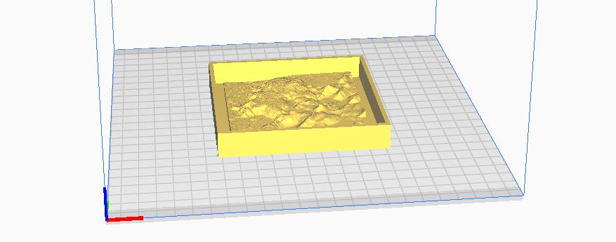
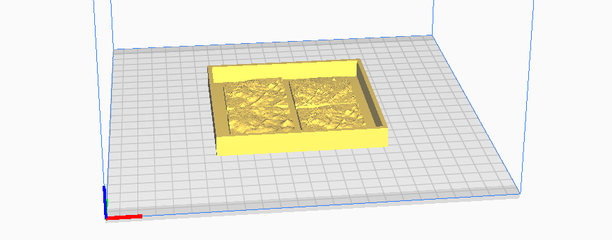

# Súkkulaðimót
[English](README.md)

Afsteypumót til að búa til silikon mót fyrir súkkulaðiafsteypur.

### [choco1piece_medium.stl](choco1piece_medium.stl)

Mót til að steypa silikonmót fyrir afsteypu á einu súkkulaðistykki. Miðþysjun.  
Stærð á móti: ca. 105mm x 105mm    
Stærð á súkkulaði: ca. 86mm x 86mm

### [choco_4pieces.stl](choco_4pieces.stl)

Mót til að steypa silikonmót fyrir afsteypu á fjórum súkkulaðistykkjum
með mismikilli þysjun.  
Stærð á móti: ca. 105mm x 105mm     
Stærð á súkkulaði: ca. 40mm x 40mm

