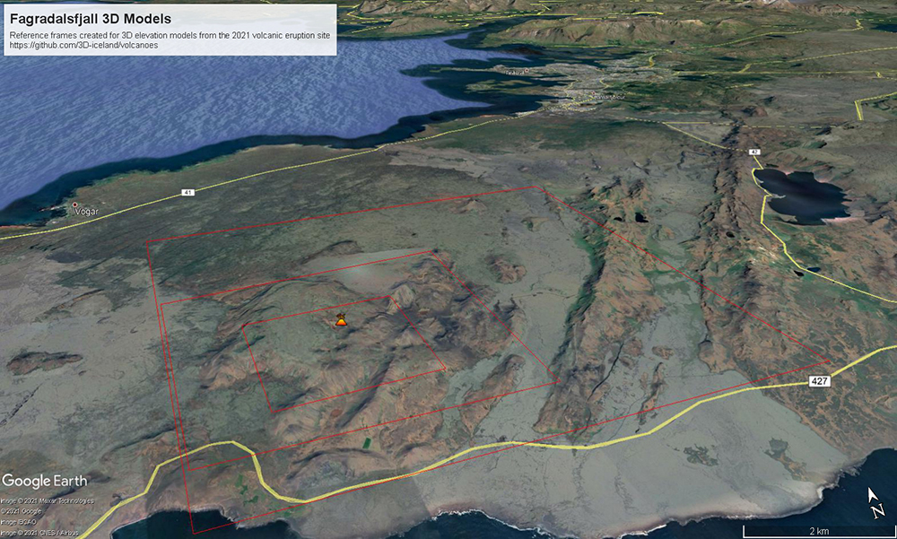

## Google Earth
[English](README.md)

Eftirfarandi mynd sýnir yfirlit yfir mismikla þysjun að gossvæði
Fagradalsfjalls. Ferningar vísa til KLM skráa sem hægt er að sækja til
að hlaða í forrit s.s. Google Earth eða QGIS.

[KLM small area](Fargradalsfjall_smallarea_GoogleEarthreferenceframe.kml)  
[KLM medium area](Fagradalsfjall_mediumarea_GoogleEarthreferenceframe.kml)  
[KLM large areae](Fargradalsfjall_largelarea_GoogleEarthreferenceframe.kml)

### KLM skrár lesnar inn í Google Earth

1. Farið á github síðu með KLM skrá 
2. Veljið "raw"
3. Vistið skrána í tölvunni.
4. Opnið [Google Earth web](https://earth.google.com/web/)  í vafra.
5. Úr "Menu" velja "Projects".
6. Veljið "Open". "Import KLM file from computer"
7. Veljið KML skrána sem þið viljið skoða.
