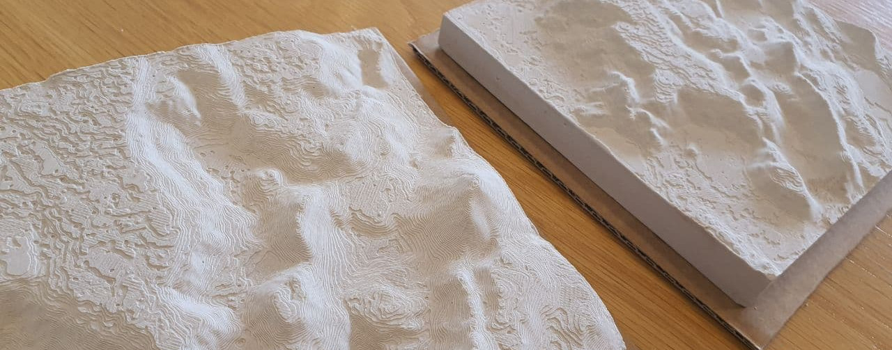
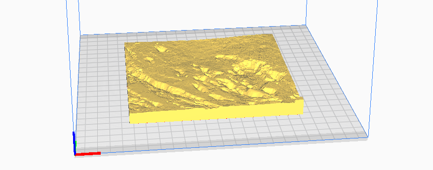
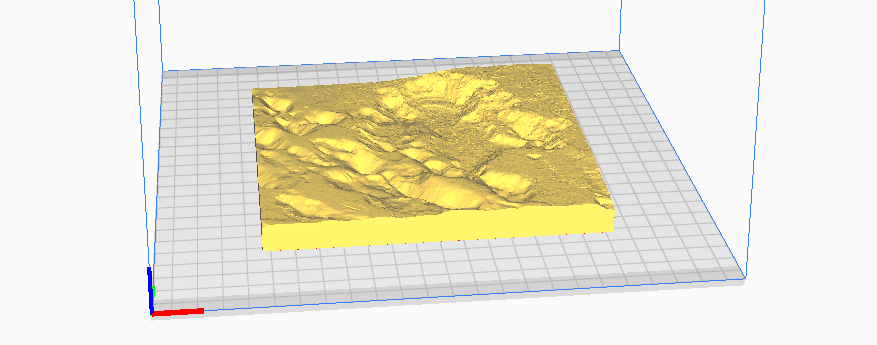
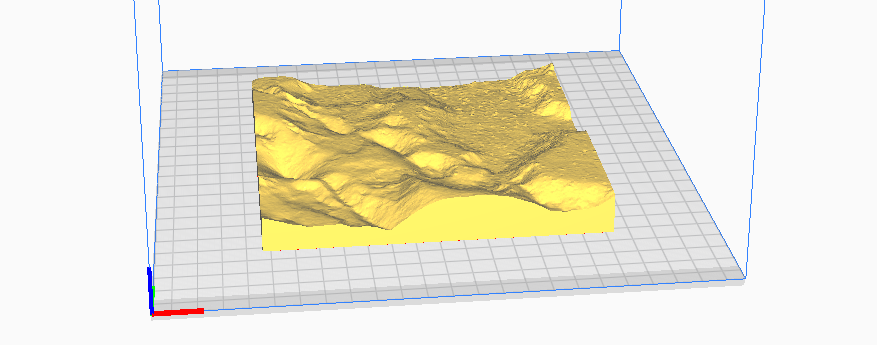
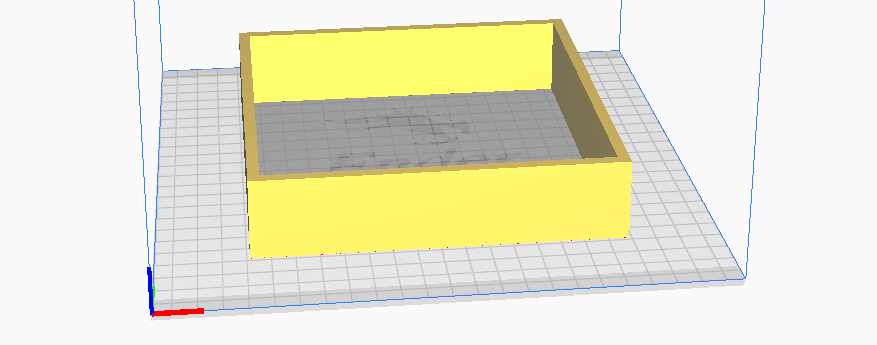
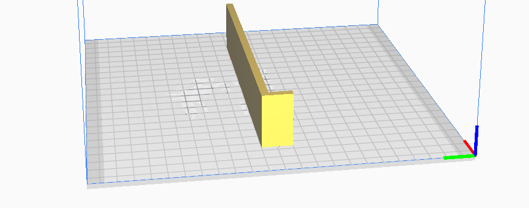
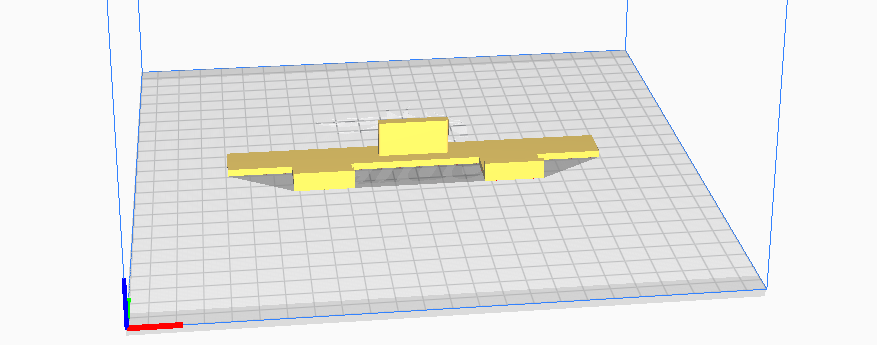
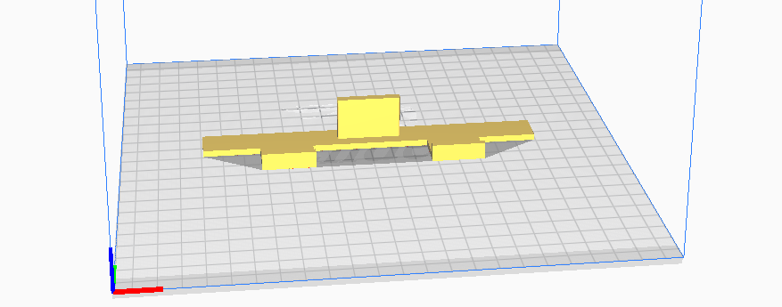

# Mold casting

- Never pour unhardened plaster into the sink or it will clog your drains.
- Do not clean 3D printed object in warm water or the PLA plastic will warp/shrink.

1. Prepare everything beforehand. Have paper towels on hand.
2. Assemble the mold. Take note to orient the mold so that North points away from you. The single piece mold is easier to manage than the four part one. You can tape the bottom of the mold to make less of a mess.
3. Weigh out water and plaster. Use gloves and a mask. Plaster is a very fine dust and you do not want to breathe it in. For one kg of water there should be 1.5 kg plaster added. Water should be cold. The colder the water is the more time you have to manipulate the plaster. To fill one mold I use 300g water against 430g plaster. Weigh them out separately.
4. Pour water into a big enough plastic container, one preferably not too rigid to to make it easier to remove excess plaster once it is hardened. Distribute plaster powder over the surface of water in even thin layers and let it sink. When islands of plaster start to form on the surface the mixture should be thick enough. You do not need to use all the plaster powder. Let the mixture sit for 2-5 minutes, then mix with a gloved hand for about a minute. Using your hands makes for less air bubbles. Mix for a little while until mixture is evenly dense. Knock the container to the table to remove excess air bubbles from mixture.
5. Oil the form. You can use any cooking oil. Take care to dab excess oil from deep depressions or your mountain peaks will become flat. Oil the sides and also if you plan to make a wall mount depression oil that object too.
6. Pour in a single spot the plaster mixture. Knock the table to let the mixture settle evenly and remove air bubbles.
7. If you use wall mounts, lay the wall mount depression on top of the mold. Remember to oil it first or it will get stuck.
8. Wait for 30-60 minutes.
9. Remove mold, sides first, then top. The mold should come off easily. If it doesn‘t, give it more time. As a last resort you can wedge the top off with a flat tool, but this may leave an impression.
10. Discard excess hardened plaster. Clean mold pieces in water. Important! Do not use too hot water or the PLA plastic will warp/shrink.

# Files
Below are descriptions of STL files for 3D printing. Load the STL files into a slicer software, for example Ultimaker Cura. The slicer software produces printer specific instructions on creating 3D printed objects, a .gcode file.

## Inverted and mirrored models

These models can be used to make casts of the area, for example in plaster of paris. The models are all the same size and can be cast using a single rectangular frame.  

### [Fagradalsfjall_largearea.stl](Fagradalsfjall_largearea_inverted.stl)
Inverted 3D relief map of area around Fagradalsfjall for casting. Area from North of Keilir, past Fagradalsfjall to shoreline.  
Size: 146.84mm x 146.84mm    
Vertical exaggeration: x 2.00    
Scale: 1:75000

### [Fagradalsfjall_mediumarea_inverted.stl](Fagradalsfjall_mediumarea_inverted.stl)
Inverted relief map of Fagradalsfjall for casting. Area encompassing all of Fagradalsfjall.  
Size: 146.84mm x 146.84mm   
Vertical exaggeration: x 1.5  
Scale: 1:40907  

### [Fagradalsfjall_smallarea_inverted.stl](Fagradalsfjall_smallarea_inverted.stl)
Inverted 3D relief map of area of Fagradalsfjall eruption for casting. Closeup of area.   
Size: 146.84mm x 146.84mm   
Vertical exaggeration: x 1.25   
Scale: 1:20455

## Mold frames

### [Mold_frame_1piece_146_84mm.stl](Mold_frame_1piece_146_84mm.stl)
Mold frame for casting relief maps. Single piece mold frame. Fits only models 146.84mm x 146.84mm.

### [Mold_frame_4piece.stl](Mold_frame_4piece.stl)
Mold frame for casting relief maps. Four pieces needed to create a frame.  Fits various sized models. Pieces are fastened together with clamps/clothes pins.

## Wall mount impressions

### [Wall_mount_impression_15mm.stl](Wall_mount_impression_15mm.stl)
Object to create an 4mm x 30mm impression into back of plaster cast for hanging on wall. 15mm deep from top of mold frame. 

### [Wall_mount_impression_20mm.stl](Wall_mount_impression_20mm.stl)
Object to create an 4mm x 30mm impression into back of plaster cast for hanging on wall. 20mm deep from top of mold frame. 

