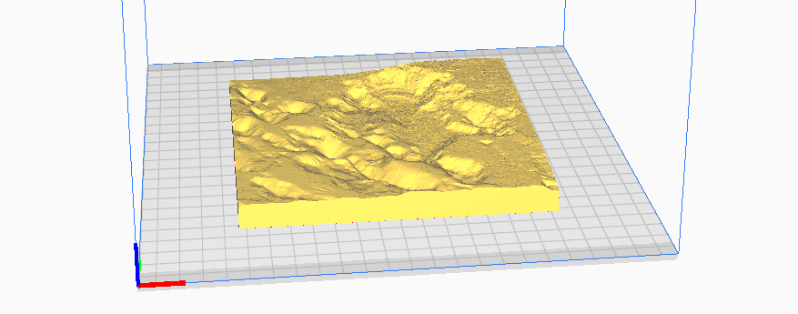
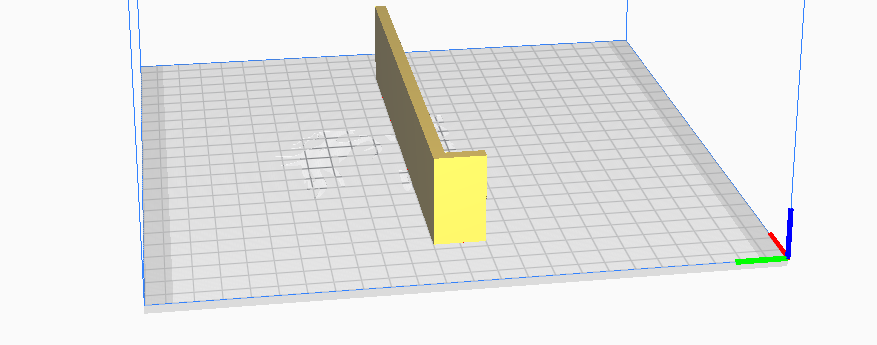

# Gifs afsteypur

- Ekki hella óhörðnuðu gifsi í vaskinn. Hann stíflast.
- Ekki þrífa 3D prentuð mót í heitu vatni. PLA plast þolir ekki háan
  hita og skreppur saman og/eða afmyndast.

## Leiðbeiningar
1. Undirbúið allt fyrirfram. Hafið þerripappír við hendina. Athugið
   hvort borðflötur halli.
2. Setjið mótið saman. Athugið að snúa mótinu þannig að Norður vísi
   frá ykkur. Það er einfaldara að steypa með einu kassamóti en
   fjögurra hluta mótinu. Límið mótin saman með málningarlímbandi svo
   ekki leki.
3. Vigtið út vatn og gifs. Notið hanska og grímu. Gifs er mjög fíngert
   duft sem ekki er gott að fá ofan í lungu. Fyrir hvert kíló af vatni
   notið um 1,5kg af gifsi. Þeim mun kaldara sem vatnið er því  lengri
   tíma hafið þið til að vinna með gifsið áður en það byrjar að
   harðna. Til að fylla eitt mót er passlegt að nota 300g vatn og 430g
   gifs. Vigtið þau í sitthvoru lagi.
4. Hellið vatni í nægilega stórt ílát. Gott er ef ílátið er
   sveigjanlegt. Það hjálpar til við að losa harðnað gifs í
   lokin. Dreifið gifsi í þunn lög yfir yfirborð vatnsins og leyfið
   því að sökkva. Þegar eyjar sem ekki sökkva byrja að myndast ætti
   blandan að vera nógu þykk. Það þarf ekki að nota allt
   gifsið. Leyfið blöndunni að bíða og draga í sig vatn í um 2-5
   mínútur. Hrærið gifsið með hanskaklæddri hendi í a.m.k. mínútu eða
   þar til blandan er öll jafnþykk. Látið ílátið dunka til að losa um loftbólur.
5. Berið olíu í mótið. Hægt er að nota t.d. matarolíu. Berið olíu á
   hliðar og ef á að búa til dæld fyrir upphengingar þá þarf að
   olíubera það stykki líka.
6. Hellið gifsblöndunni á einn punkt í mótinu. Lemjið í borð eða mót
   til að losa um loftbólur og láta gifsið dreifast jafnt.
7. Ef nota á upphengimót leggið það ofan á mótið svo það myndi dæld
   ofan í bakhlið afsteypunnar. Ekki gleyma að olíubera það fyrst.
8. Bíðið í 30-60 mínútur þar til gifsið hættir að hitna.
9. Fjarlægið mót, hliðar fyrst. Ýtið mótinu úr með því að þrýsta
   lítillega á hvert horn í einu þar til það er laust. Látið mótið standa aðeins lengur til að þurrka hliðarnar svo þær brotni ekki þegar toppstykkið er
   fjarlægt. Fjarlægið toppstykkið með því að beita þrýstingi á
   hornin eitt í einu. Ef mótið vill alls ekki losna er hægt að losa
   það með flötu áhaldi, en það getur skilið eftir sig far.
10. Hendið hörðnuðu gifsi og þrífið mót í köldu vatni.

## Skrár
Hér fyrir neðan eru lýsingar á STL skrám fyrir 3D prentun. Hlaðið STL
skránum í sneiðingarforrit, t.d. Ultimaker Cura. Sneiðingarforritið
býr til prentleiðbeiningar sem eru sértækar fyrir 3D prentarann,
s.k. gcode skrá.

## Viðsnúin og spegluð líkön

Þessi líkön eru til að búa til afsteypur af svæðum, til dæmis í
gifs. Líkönin eru öll af sömu stærð og má steypa með tilheyrandi ramma.  

### [Fagradalsfjall_largearea.stl](Fagradalsfjall_largearea_inverted.stl)
Viðsnúið upphleypt kort af svæði umhverfis Fagradalsfjall. Svæðið nær
frá Keili til strandar.  
Stærð: 146,84mm x 146,84mm    
Ýking á Z ási: x 2,00    
Skali: 1:75000

### [Fagradalsfjall_mediumarea_inverted.stl](Fagradalsfjall_mediumarea_inverted.stl)
Viðsnúið upphleypt kort af svæði umhverfis Fagradalsfjall.  Svæðið nær
yfir allt Fagradalsfjall.  
Stærð: 146,84mm x 146,84mm   
Ýking á Z ási: x 1,5  
Skali: 1:40907  

### [Fagradalsfjall_smallarea_inverted.stl](Fagradalsfjall_smallarea_inverted.stl)
Viðsnúið upphleypt kort af gossvæði á Fagradalsfjalli. Nærmynd.   
Stærð: 146,84mm x 146,84mm   
Ýking á Z ási: x 1,25   
Skali: 1:20455

## Rammar fyrir afsteypur

### [Mold_frame_1piece_146_84mm.stl](Mold_frame_1piece_146_84mm.stl)
Rammi til að gera gifsafsteypu. Passar fyrir líkön sem eru 146,84mm x 146,84mm.

### [Mold_frame_4piece.stl](Mold_frame_4piece.stl)
Stykki til að mynda ramma fyrir gifsafsteypu. Það þarf fjögur stykki
til a mynda ramma. Passar á misstór líkön. Stykkin eru klemmd saman
með þvingum eða klemmum.

## Veggupphengjur

### [Wall_mount_impression_15mm.stl](Wall_mount_impression_15mm.stl)
Stykki til að mynda 4mm x 30mm far í bakhlið afsteypu til að hengja á
vegg. Stykkið nær 15mm niður frá toppi rammans. 

### [Wall_mount_impression_20mm.stl](Wall_mount_impression_20mm.stl)
Stykki til að mynda 4mm x 30mm far í bakhlið afsteypu til að hengja á
vegg. Stykkið nær 20mm niður frá toppi rammans. 

