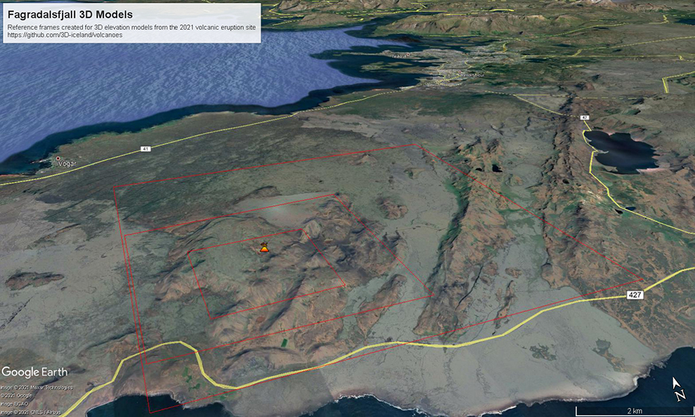

# Volcanoes

Models of Icelandic volcanoes for 3D printing of relief maps and molds for plaster casting.  

An volcanic eruption started at 20:45 GMT 19. March 2021 in the Geldingadalir valley at Fagradalsfjall, e. 'Beautiful valley mountain', on the Reykjanes peninsula, South-West Iceland.

The Digital Elevation Model used here is based on the ArcticDEM dataset created from DigitalGlobe, Inc., imagery and funded under National Science Foundation awards 1043681, 1559691, and 1542736. The DEM was manually adjusted to remove errors and gaps in the data. STL files were created using QGIS software utilising the DEMto3D plugin. Slicing of 3D maps and mirroring of the inverted relief maps were realised in Ultimaker Cura.

## GoogleEarth overview
See files in [KLM_refererences](KLM_refererences/) folder. 

The following image shows an overview of the three zoom areas created for the Fagradalsfjall eruption site. Each rectange relates to the KML file available for download in this repository to allow an exploration of the area in GoogleEarth and other GIS tools.

[KLM small area](KLM_refererences/Fargradalsfjall_smallarea_GoogleEarthreferenceframe.kml)  
[KLM medium area](KLM_refererences/Fagradalsfjall_mediumarea_GoogleEarthreferenceframe.kml)  
[KLM large areae](KLM_refererences/Fargradalsfjall_largelarea_GoogleEarthreferenceframe.kml)

## Slicing of STL files
3D models are prepared for printing in Ultimaker Cura configured for Crealty Ender Pro printer.  Important: Top and bottom thickness has been doubled from 0.8mm to 1.6mm. Top thickness or else elevation lines may misprint in 3D printer. If making plaster molds, bottom thickness needs to be increased so the model does not deform when released from mold frame.

## Plaster casting
See instructions and files in [Molds_for_plaster_casting](Molds_for_plaster_casting/) folder.  Youtube video below.

## Licence

[![CC BY 4.0][cc-by-shield]][cc-by]

This work is licensed under a
[Creative Commons Attribution 4.0 International License][cc-by].

[cc-by]: http://creativecommons.org/licenses/by/4.0/
[cc-by-image]: https://i.creativecommons.org/l/by/4.0/88x31.png
[cc-by-shield]: https://img.shields.io/badge/License-CC%20BY%204.0-lightgrey.svg

