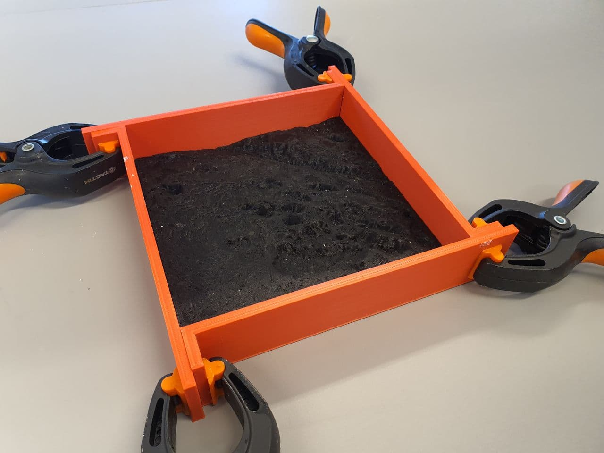

# volcanoes

Models of Icelandic volcanoes for 3D printing of relief maps.  

An volcanic eruption started at 20:45 GMT 19. March 2021 in the Geldingadalir valley at Fagradalsfjall, e. 'Beautiful valley mountain', on the Reykjanes peninsula, South-West Iceland.

The Digital Elevation Model used here is based on the ArcticDEM dataset created from DigitalGlobe, Inc., imagery and funded under National Science Foundation awards 1043681, 1559691, and 1542736. The DEM was manually adjusted to remove errors and gaps in the data. STL files were created using QGIS software utilising the DEMto3D plugin. Slicing of 3D maps and mirroring of the inverted relief maps were realised in Ultimaker Cura.

## Files

### Fagradalsfjall_largearea.stl
Description: 3D relief map of area around Fagradalsfjall. Area from North of Keilir, past Fagradalsfjall to shoreline.  
Size: 146.84mm x 146.84mm  
Vertical exaggeration: x 2.00  
Scale: 1:75000  

### Fagradalsfjall_largearea_inverted.stl
Description: Inverted 3D relief map of area around Fagradalsfjall for casting. Area from North of Keilir, past Fagradalsfjall to shoreline.  
Size: 146.84mm x 146.84mm  
Vertical exaggeration: x 2.00  
Scale: 1:75000

### Fagradalsfjall_smallarea.stl
Description: 3D relief map of area of Fagradalsfjall eruption for casting. Closeup of area.   
Size: 146.84mm x 146.84mm  
Vertical exaggeration: x 1.25
Scale: 1:20455  

### Fagradalsfjall_smallarea_inverted.stl
Description: Inverted 3D relief map of area of Fagradalsfjall eruption for casting. Closeup of area. 
Size: 146.84mm x 146.84mm  
Vertical exaggeration: x 1.25  
Scale: 1:20455

### Mold_frame_4piece.stl
Description: Mold frame for casting relief maps. Four pieces needed to create a frame.  Fits various sized models. Pieces are fastened together with clamps/clothes pins.

### Wall_mount_10mm_impression.stl
Description: Object to create an 4mm x 30mm impression into back of plaster cast for hanging on wall. 10mm deep from top of mold frame. 

### Wall_mount_15mm_impression.stl
Description: Object to create an 4mm x 30mm impression into back of plaster cast for hanging on wall. 15mm deep from top of mold frame. 

### Wall_mount_20mm_impression.stl
Description: Object to create an 4mm x 30mm impression into back of plaster cast for hanging on wall. 20mm deep from top of mold frame. 

## Slicing of STL files
3D models are prepared for printing in Ultimaker Cura configured for Crealty Ender Pro printer.  Important: Top thickness has been doubled from 0.8mm to 1.6mm. 

## Mold casting

## Licence

[![CC BY 4.0][cc-by-shield]][cc-by]

This work is licensed under a
[Creative Commons Attribution 4.0 International License][cc-by].

[cc-by]: http://creativecommons.org/licenses/by/4.0/
[cc-by-image]: https://i.creativecommons.org/l/by/4.0/88x31.png
[cc-by-shield]: https://img.shields.io/badge/License-CC%20BY%204.0-lightgrey.svg

