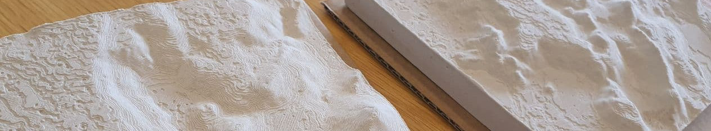

# Volcanoes

Models of Icelandic volcanoes for 3D printing of relief maps,molds for plaster casting and chocolate making. All data in this repository is free to use for educational, personal or commercial purposes. Please attribute either this repository or Geo-Vis lab at University of Iceland.

An volcanic eruption started at 20:45 GMT 19. March 2021 in the Geldingadalir valley at Fagradalsfjall, e. 'Beautiful valley mountain', on the Reykjanes peninsula, South-West Iceland.

## Relief maps

STL files for 3D printing 15 x 15 cm relief map models at three zoom levels. See instructions and files in [Relief_maps](Relief_maps/) folder.

## Plaster casting

STL files for 3D printing plaster of paris casting molds and accessories. See instructions and files in [Molds_for_plaster_casting](Molds_for_plaster_casting/) folder.  Timelapse instructional [YouTube video](http://www.youtube.com/watch?v=xSu4fhIfEEE) below.

## Chocolate molds

STL files for 3D printing molds for casting silicone molds for chocolate making. See files in [Chocolate_molds](Chocolate_molds/) folder. 

## GoogleEarth overview

KLM files for loading into [Google Earth](https://earth.google.com/web/). See files and instructions in [KLM_refererences](KLM_refererences/) folder. 

## Slicing of STL files

3D models are prepared for printing in Ultimaker Cura configured for Crealty Ender Pro printer.  Important: Top and bottom thickness has been doubled from 0.8mm to 1.6mm. Top thickness needs to be increased or else elevation lines may misprint in 3D printer. If making plaster molds, bottom thickness also needs to be increased so the model does not deform when pressed to release from mold frame.

## Credits

The Digital Elevation Model used here is based on the ArcticDEM dataset created from DigitalGlobe, Inc., imagery and funded under National Science Foundation awards 1043681, 1559691, and 1542736. The DEM was manually adjusted to remove errors and gaps in the data. STL files were created using QGIS software utilising the DEMto3D plugin. Slicing of 3D maps and mirroring of the inverted relief maps were realised in Ultimaker Cura.

See [Credits.md](Credits.md) file.

## Licence

[![CC BY 4.0][cc-by-shield]][cc-by]

This work is licensed under a
[Creative Commons Attribution 4.0 International License][cc-by].

[cc-by]: http://creativecommons.org/licenses/by/4.0/
[cc-by-image]: https://i.creativecommons.org/l/by/4.0/88x31.png
[cc-by-shield]: https://img.shields.io/badge/License-CC%20BY%204.0-lightgrey.svg

