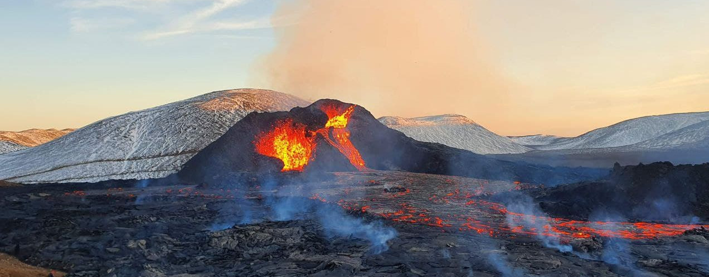
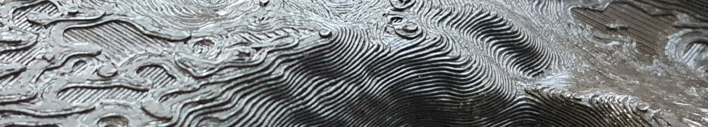
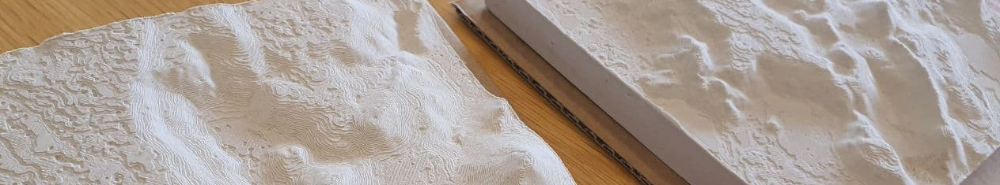
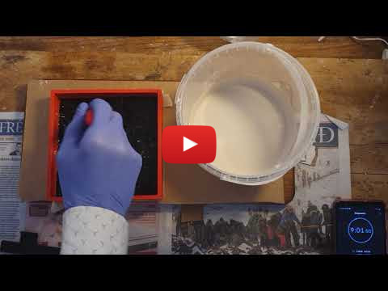
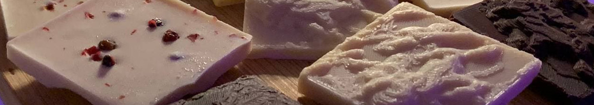
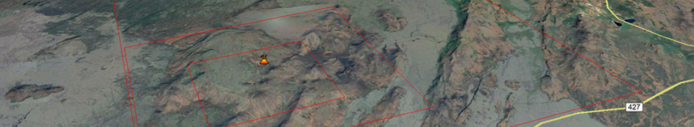

# Eldfjöll
[English](README.md)

*Eldgos hófst kl 20:45, 19. mars 2021 í Geldingadölum Fagradalsfjalls
á Reykjanesi. Eldgosið stendur enn yfir.*

Hér eru þrívíddarmódel af íslenskum eldfjöllum til að búa til upphleypt kort,
mót fyrir gifsafsteypur og mót fyrir súkkulaði. Öll gögn á þessu svæði
eru með opnu höfundaleyfi. Þau má nota jafnt til kennslu, einkanota eða í
ágóðaskyni. Vinsamlegast vísið til þessarar síðu eða á Geo-Vis lab
Háskóla Íslands.

## Upphleypt kort

STL skrár til að 3D prenta ca. 15 x 15 cm upphleypt kort með mismikilli
þysjun. Skrár og upplýsingar í [Relief_maps](Relief_maps/) möppu.

## Gifs afsteypur

STL skrár til að 3D prenta mót og fylgihluti til að búa til gifsafsteypur ca. 15cm x 15 cm að stærð. Skrár og leiðbeiningar í [Molds_for_plaster_casting](Molds_for_plaster_casting/) möppu. [YouTube video](http://www.youtube.com/watch?v=xSu4fhIfEEE) hér fyrir neðan.

## Súkkulaði mót

STL skrár til að prenta mót til að steypa silikon mót. Silikon mót má nota til að búa til súkkulaði afsteypur. Sjá skrár í [Chocolate_molds](Chocolate_molds/) möppu. 

## Google Earth 

KLM skrár til að hlaða í [Google Earth web](https://earth.google.com/web/). Skrár og leiðbeiningar í [KLM_refererences](KLM_refererences/) möppu.

## Sneiðing á STL skrám

3D líkön eru undirbúin til prentunar í Ultimaker Cura forriti sem er
stillt fyrir Crealty Ender 3 Pro þrívíddarprentara. Athugið: Þykkt á toppi og botni hefur verið tvöfölduð úr 0.8mm í 1.6mm. Toppinn þarf að þykkja til að prentarinn ráði við að teikna hæðarlínur. Botninn á afsteypumótum er þykktur til að styrkja hann svo hann afmyndist ekki þegar mótið er losað sundur.

## 3D prentun
Fyrir súkkulaðimót getur borgað sig að prenta í hæstu gæðum
mögulegum. Prentarinn sem hér er notaður prentar venjulega
í 0,2mm upplausn, í hæstu gæðum prentar hann í 0,12mm upplausn. Það
tekur lengri tíma, en skilar sér í aukinni upplausn og fínni
hæðarlínum. Gifsmót í 0,2mm upplausn gefur afsteypu með skýrari
skugga og skarpari áferð.

## Tilvísanir

Stafræna hæðarlíkanið (DEM, Digital Elevation Model) sem notað er hér er byggt á [ArcticDEM](https://www.pgc.umn.edu/data/arcticdem/) gagnasettinu
sem er gert úr myndgögnum frá DigitalGlobe, Inc. og kostað af "National
Science Foundation awards 1043681, 1559691, 1542736". Hæðarlíkanið var lagfært handvirkt til að fjarlægja villur og göt
í gögnunum.

STL skrár voru búnar til í [QGIS](https://qgis.org) forritinu með
[DEMto3D](https://demto3d.com/en/) viðbót. Sneiðing á STL skrám og
speglun á viðsnúnum kortum var gerð í [Ultimaker
Cura](https://ultimaker.com/software/ultimaker-cura). Súkkulaðimót
voru búin til í [Blender](https://www.blender.org/) forritinu. Prentað
með 
[Crealty Ender 3
Pro](https://www.creality3dofficial.com/collections/ender-series/products/creality-ender-3-pro-3d-printer).

Sjá [Credits.md](Credits.md).

## Leyfi

[![CC BY 4.0][cc-by-shield]][cc-by]

This work is licensed under a
[Creative Commons Attribution 4.0 International License][cc-by].

[cc-by]: http://creativecommons.org/licenses/by/4.0/
[cc-by-image]: https://i.creativecommons.org/l/by/4.0/88x31.png
[cc-by-shield]: https://img.shields.io/badge/License-CC%20BY%204.0-lightgrey.svg

