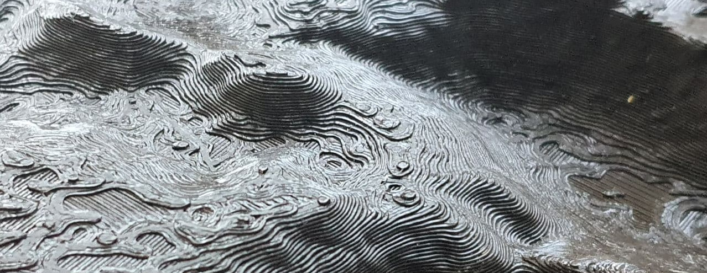
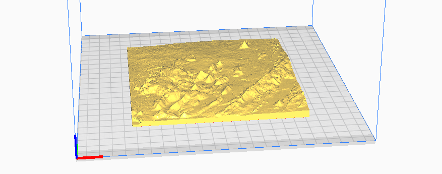
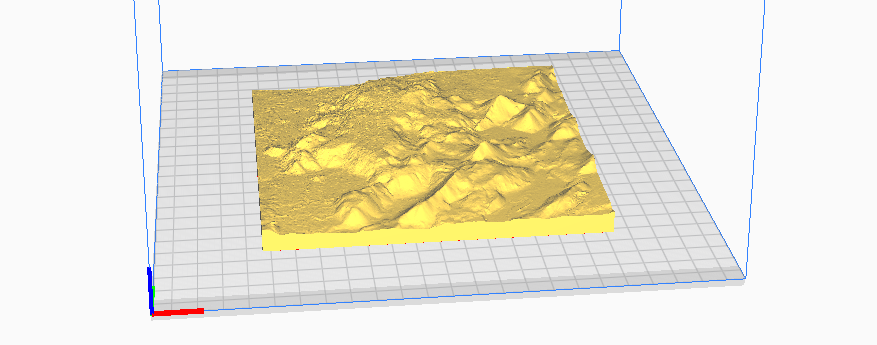
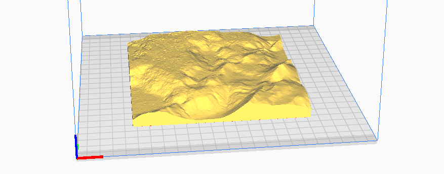

## Relief map .stl files

### [Fagradalsfjall_largearea.stl](Fagradalsfjall_largearea.stl)
Description: 3D relief map of area around Fagradalsfjall. Area from North of Keilir, past Fagradalsfjall to shoreline.  
Size: 146.84mm x 146.84mm  
Vertical exaggeration: x 2.00  
Scale: 1:75000  

### [Fagradalsfjall_mediumarea.stl](Fagradalsfjall_mediumarea.stl)
Description: 3D relief map of Fagradalsfjall. Area encompassing all of Fagradalsfjall.  
Size: 146.84mm x 146.84mm   
Vertical exaggeration: x 1.5  
Scale: 1:40907  

### [Fagradalsfjall_smallarea.stl](Fagradalsfjall_smallarea.stl)
Description: 3D relief map of area of Fagradalsfjall eruption. Closeup of area.    
Size: 146.84mm x 146.84mm   
Vertical exaggeration: x 1.25  
Scale: 1:20455  

